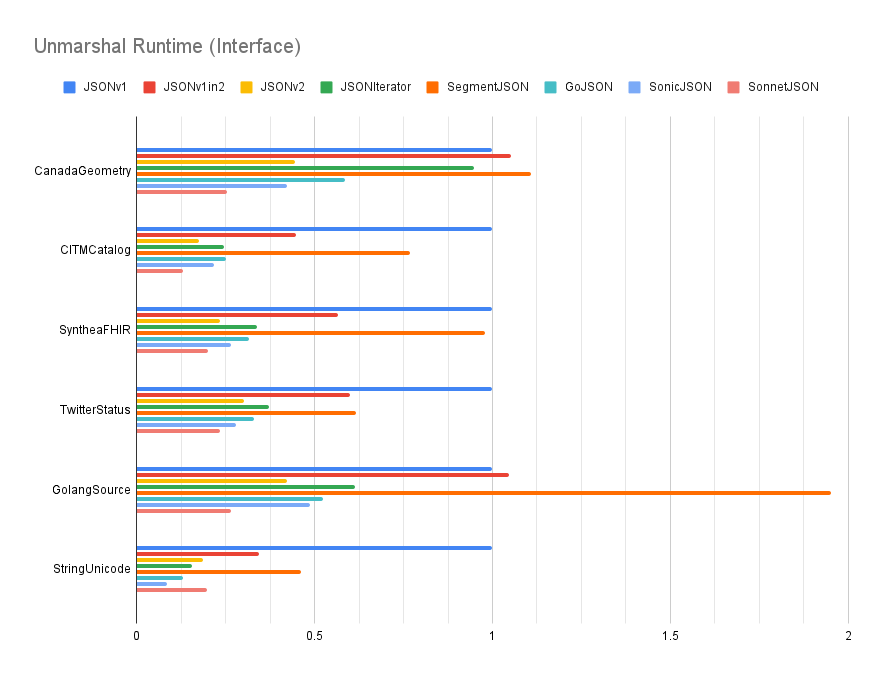

# JSON Benchmarks

Each of the charts below show the performance across
several different JSON implementations:

* `JSONv1` is `encoding/json` at `v1.23.5`
* `JSONv1in2` is `github.com/go-json-experiment/json/v1` at `v0.0.0-20250127181117-bbe7ee0d7d2c`
* `JSONv2` is `github.com/go-json-experiment/json` at `v0.0.0-20250127181117-bbe7ee0d7d2c`
* `JSONIterator` is `github.com/json-iterator/go` at `v1.1.12`
* `SegmentJSON` is `github.com/segmentio/encoding/json` at `v0.4.1`
* `GoJSON` is `github.com/goccy/go-json` at `v0.10.4`
* `SonicJSON` is `github.com/bytedance/sonic` at `v1.12.7`
* `SonnetJSON` is `github.com/sugawarayuuta/sonnet` at `v0.0.0-20231004000330-239c7b6e4ce8`

The `JSONv1in2` implementation replicates the `JSONv1` API and behavior
purely in terms of the `JSONv2` implementation by setting the appropriate
set of options to reproduce legacy v1 behavior.

The Go toolchain used is `v1.23.5`.

Based on the module proxy as of 2025-01-22, the relative popularity of each:
* `JSONv1` has 1.3M imports
* `JSONv1in2` has 8 imports
* `JSONv2` has 213 imports
* `JSONIterator` has 15k imports
* `SegmentJSON` has 317 imports
* `GoJSON` has 3k imports
* `SonicJSON` has 1k imports
* `SonnetJSON` has 13 imports

Note that `JSONv2` deliberately dissuades users from depending on the package
as it is an experiment and is subject to major breaking changes.

Benchmarks were run across various datasets:

* `CanadaGeometry` is a GeoJSON (RFC 7946) representation of Canada.
  It contains many JSON arrays of arrays of two-element arrays of numbers.
* `CITMCatalog` contains many JSON objects using numeric names.
* `SyntheaFHIR` is sample JSON data from the healthcare industry.
  It contains many nested JSON objects with mostly string values,
  where the set of unique string values is relatively small.
* `TwitterStatus` is the JSON response from the Twitter API.
  It contains a mix of all different JSON kinds, where string values
  are a mix of both single-byte ASCII and multi-byte Unicode.
* `GolangSource` is a simple tree representing the Go source code.
  It contains many nested JSON objects, each with the same schema.
* `StringUnicode` contains many strings with multi-byte Unicode runes.

All of the implementations other than `JSONv1`, `JSONv1in2`, `JSONv2`, and `Sonnet` make extensive use of `unsafe`. As such, we expect those to generally be faster,
but at the cost of memory and type safety. `SonicJSON` goes a step even further
and uses just-in-time compilation to generate machine code specialized
for the Go type being marshaled or unmarshaled.
Also, `SonicJSON` does not validate JSON strings for valid UTF-8,
and so gains a notable performance boost on datasets with multi-byte Unicode.
Benchmarks are performed based on the default marshal and unmarshal behavior
of each package. Note that `JSONv2` aims to be safe and correct by default,
which may not be the most performant strategy.

`JSONv2` has several semantic changes relative to `JSONv1` that
impacts performance:

1.  When marshaling, `JSONv2` no longer sorts the keys of a Go map.
    This will improve performance.

2.  When marshaling or unmarshaling, `JSONv2` always checks
    to make sure JSON object names are unique.
    This will hurt performance, but is more correct.

3.  When marshaling or unmarshaling, `JSONv2` always
    shallow copies the underlying value for a Go interface and
    shallow copies the key and value for entries in a Go map.
    This is done to keep the value as addressable so that `JSONv2` can
    call methods and functions that operate on a pointer receiver.
    This will hurt performance, but is more correct.

4.  When marshaling or unmarshaling, `JSONv2` supports calling
    type-defined methods or caller-defined functions with the current
    `jsontext.Encoder` or `jsontext.Decoder`. The `Encoder` or `Decoder` must
    contain a state machine to validate calls according to the JSON grammar.
    Maintaining this state will hurt performance.
    The `JSONv1` API provides no means for obtaining the `Encoder` or `Decoder`
    so it never needed to explicitly maintain a state machine.
    Conformance to the JSON grammar is implicitly accomplished
    by matching against the structure of the call stack.

All of the charts are unit-less since the values are normalized
relative to `JSONv1`, which is why `JSONv1` always has a value of 1.
A lower value is better (i.e., runs faster).

Benchmarks were performed on an AMD Ryzen 9 9950X.

## Marshal Performance

### Concrete types


* This compares marshal performance when serializing
  [from concrete types](/testdata_test.go).
* Relative to `JSONv1`, `JSONv2` is 1.4x faster to 1.2x slower.
* Relative to `JSONv1in2`, `JSONv2` is at performance parity.
* Relative to `JSONIterator`, `JSONv2` is up to 1.2x faster.
* Relative to `SegmentJSON`, `JSONv2` is up to 2.0x slower.
* Relative to `GoJSON`, `JSONv2` is 1.1x faster to 1.4x slower.
* Relative to `SonicJSON`, `JSONv2` is 1.2x to 3.4x slower
  (ignoring `StringUnicode` since `SonicJSON` does not validate UTF-8).
* Relative to `SonnetJSON`, `JSONv2` is up to 1.5x slower.
* For `JSONv1` and `JSONv2`, marshaling from concrete types is
  significantly limited by the performance of Go reflection.

### Interface types


* This compares marshal performance when serializing from
  `any`, `map[string]any`, and `[]any` types.
* Relative to `JSONv1`, `JSONv2` is 1.6x to 3.6x faster.
* Relative to `JSONv1in2`, `JSONv2` is up to 2.2x faster.
* Relative to `JSONIterator`, `JSONv2` is up to 2.6x faster.
* Relative to `SegmentJSON`, `JSONv2` is 1.1x to 3.5x faster.
* Relative to `GoJSON`, `JSONv2` is 1.5x to 3.5x faster.
* Relative to `SonicJSON`, `JSONv2` is 1.4x faster to 1.3x slower
  (ignoring `StringUnicode` since `SonicJSON` does not validate UTF-8).
* Relative to `SonnetJSON`, `JSONv2` is up to 1.8x faster.
* `JSONv2` is generally as fast or faster than the alternatives.
  One advantange is because it does not sort the keys for a `map[string]any`,
  while alternatives (except `JSONIterator`, `SonicJSON` and `SonnetJSON`)
  do sort the keys.

### RawValue types


* This compares performance when marshaling from a `jsontext.Value`.
  This mostly exercises the underlying encoder and
  hides the cost of Go reflection.
* Relative to `JSONv1`, `JSONv2` is 5.6x to 12.0x faster.
* Relative to `JSONv1in2`, `JSONv2` is up to 1.3x slower
  (since `JSONv2` needs to check for duplicate object names).
* `JSONIterator` is blazingly fast because
  [it does not validate whether the raw value is valid](https://go.dev/play/p/bun9IXQCKRe)
  and simply copies it to the output.
* Relative to `SegmentJSON`, `JSONv2` is 1.4x to 2.6x faster.
* Relative to `GoJSON`, `JSONv2` is 2.7x faster to 1.4x slower.
* Relative to `SonicJSON`, `JSONv2` is up to 1.8x faster
  (ignoring `StringUnicode` since `SonicJSON` does not validate UTF-8).
* Relative to `SonnetJSON`, `JSONv2` is at performance parity.
* Aside from `JSONIterator` and `JSONv1in2`,
  `JSONv2` is generally as fast or fastest.

## Unmarshal Performance

### Concrete types


* This compares unmarshal performance when deserializing
  [into concrete types](/testdata_test.go).
* Relative to `JSONv1`, `JSONv2` is 2.7x to 10.2x faster.
* Relative to `JSONv1in2`, `JSONv2` is 1.1x to 1.3x faster.
* Relative to `JSONIterator`, `JSONv2` is 1.3x faster to 1.5x slower.
* Relative to `SegmentJSON`, `JSONv2` is up to 1.9x slower.
* Relative to `GoJSON`, `JSONv2` is 1.3x to 1.8x slower.
* Relative to `SonicJSON`, `JSONv2` is up to 2.8x slower
  (ignoring `StringUnicode` since `SonicJSON` does not validate UTF-8).
* Relative to `SonnetJSON`, `JSONv2` is up to 2.1x slower.
* For `JSONv1` and `JSONv2`, unmarshaling into concrete types is
  significantly limited by the performance of Go reflection.

### Interface types



* This compares unmarshal performance when deserializing into
  `any`, `map[string]any`, and `[]any` types.
* Relative to `JSONv1`, `JSONv2` is 2.3x to 5.7x faster.
* Relative to `JSONv1in2`, `JSONv2` is 1.8x to 2.6x faster
  (since `JSONv1in2` lacks a specialized fast-path for interface types).
* Relative to `JSONIterator`, `JSONv2` is up to 2.1x faster.
* Relative to `SegmentJSON`, `JSONv2` is 2.5x to 4.6x faster.
* Relative to `GoJSON`, `JSONv2` is up to 1.4x faster.
* Relative to `SonicJSON`, `JSONv2` is 1.2x faster to 1.1x slower
  (ignoring `StringUnicode` since `SonicJSON` does not validate UTF-8).
* Relative to `SonnetJSON`, `JSONv2` is 1.2x to 1.8x slower.
* Aside from `SonnetJSON`, `JSONv2` is generally just as fast
  or faster than all the alternatives.

### RawValue types


* This compares performance when unmarshaling into a `jsontext.Value`.
  This mostly exercises the underlying decoder and
  hides away most of the cost of Go reflection.
* Relative to `JSONv1`, `JSONv2` is 10.2x to 21.1x faster.
* Relative to `JSONv1in2`, `JSONv2` is 1.3x to 1.9x faster.
* Relative to `JSONIterator`, `JSONv2` is up to 2.2x faster.
* Relative to `SegmentJSON`, `JSONv2` is up to 2.0x slower.
* Relative to `GoJSON`, `JSONv2` is 1.6x faster to 1.4x slower.
* Relative to `SonicJSON`, `JSONv2` is up to 2.1x faster
  (ignoring `StringUnicode` since `SonicJSON` does not validate UTF-8).
* Relative to `SonnetJSON`, `JSONv2` is 1.2x faster to 1.3x slower.
* `JSONv1` takes a
  [lexical scanning approach](https://talks.golang.org/2011/lex.slide#1),
  which performs a virtual function call for every byte of input.
  In contrast, `JSONv2` makes heavy use of iterative and linear parsing logic
  (with extra complexity to resume parsing when encountering segmented buffers).
* Aside from `SegmentJSON`, `JSONv2` is generally just as fast
  or faster than all the alternatives.

# Streaming

When reading from an `io.Reader` and writing to an `io.Writer`,
a JSON implementation should not need a buffer much larger than
the largest JSON token encountered within the entire JSON value.
For example, marshaling and unmarshaling a `[{},{},{},{},{},...]`
that is a gigabyte in size should not need to buffer the entire JSON array,
but only enough to buffer each individual `{` or `}`.
An implementation with true streaming support will use
a fixed amount of memory regardless of the total size of the JSON value.

The following implementations have true streaming support:

| Implementation | Marshal | Unmarshal |
| -------------- | ------- | --------- |
| JSONv1         | ❌      | ❌        |
| JSONv1in2      | ❌      | ❌        |
| JSONv2         | ✔️      | ✔️        |
| JSONIterator   | ❌      | ✔️        |
| SegmentJSON    | ❌      | ❌        |
| GoJSON         | ❌      | ❌        |
| SonicJSON      | ❌      | ❌        |
| SonnetJSON     | ❌      | ❌        |

* `JSONv2` was designed from the beginning to have true streaming support.
* `JSONIterator` (perhaps in honor of the "iterator" in its name)
  prioritize true streaming, but only for unmarshaling.

See [`TestStreaming`](/bench_test.go#:~:text=TestStreaming) for more information.

# Correctness

A package may be fast, but it must still be correct and realiable.

* `GoJSON` non-deterministically fails on some tests in this module:
  ```
  --- FAIL: TestRoundtrip/TwitterStatus/Interface/GoJSON/MarshalWrite (0.04s)
  Marshal error: encoder: opcode  has not been implemented
  ```
  ```
  --- FAIL: TestRoundtrip/GolangSource/Interface/GoJSON/MarshalWrite (0.16s)
  Marshal error: opcode SliceEnd has not been implemented
  ```
  ```
  --- FAIL: TestRoundtrip/GolangSource/Interface/GoJSON/Marshal
  Marshal error: invalid character ',' after object key
  ```
  ```
  --- FAIL: TestRoundtrip/TwitterStatus/Interface/GoJSON/MarshalWrite (0.01s)
  panic: runtime error: slice bounds out of range [10409248:74824]

  goroutine 111 [running]:
  testing.tRunner.func1.2({0xa3c220, 0xc002cec228})
    go1.23.5/src/testing/testing.go:1632 +0x230
  testing.tRunner.func1()
    go1.23.5/src/testing/testing.go:1635 +0x35e
  panic({0xa3c220?, 0xc002cec228?})
    go1.23.5/src/runtime/panic.go:785 +0x132
  github.com/goccy/go-json/internal/encoder/vm.Run(0xc00308a000, {0xc003088000?, 0x0?, 0x400?}, 0xc000ce9880?)
    github.com/goccy/go-json@v0.10.4/internal/encoder/vm/vm.go:440 +0x25ae5
  github.com/goccy/go-json.encodeRunCode(0xc00308a000?, {0xc003088000?, 0x0?, 0xc0001a53c0?}, 0xc002fb5d38?)
    github.com/goccy/go-json@v0.10.4/encode.go:310 +0x56
  github.com/goccy/go-json.encode(0xc00308a000, {0x9be140, 0xc002022fb0})
    github.com/goccy/go-json@v0.10.4/encode.go:235 +0x205
  github.com/goccy/go-json.(*Encoder).encodeWithOption(0xc003093e58, 0xc00308a000, {0x9be140, 0xc002022fb0}, {0x0, 0x0, 0xc002fb5e90?})
    github.com/goccy/go-json@v0.10.4/encode.go:77 +0x129
  github.com/goccy/go-json.(*Encoder).EncodeWithOption(0xc002fb5e58, {0x9be140, 0xc002022fb0}, {0x0, 0x0, 0x0})
    github.com/goccy/go-json@v0.10.4/encode.go:42 +0x89
  github.com/goccy/go-json.(*Encoder).Encode(...)
    github.com/goccy/go-json@v0.10.4/encode.go:34
  jsonbench.init.func19({0xb55e20?, 0xc003086000?}, {0x9be140?, 0xc002022fb0?})
    github.com/go-json-experiment/jsonbench/bench_test.go:121 +0x69
  jsonbench.TestRoundtrip.func3(0xc001fd0ea0)
    github.com/go-json-experiment/jsonbench/bench_test.go:175 +0x135
  testing.tRunner(0xc001fd0ea0, 0xc0004efa80)
    go1.23.5/src/testing/testing.go:1690 +0xf4
  created by testing.(*T).Run in goroutine 9
    go1.23.5/src/testing/testing.go:1743 +0x390
  exit status 2
  ```
  ```
  --- FAIL: TestRoundtrip/TwitterStatus/Interface/GoJSON/MarshalWrite (0.03s)
  panic: runtime error: invalid memory address or nil pointer dereference
  [signal SIGSEGV: segmentation violation code=0x1 addr=0x0 pc=0x859f9e]

  goroutine 114 [running]:
  testing.tRunner.func1.2({0x9f1ee0, 0xf8a7b0})
    go1.23.5/src/testing/testing.go:1632 +0x230
  testing.tRunner.func1()
    go1.23.5/src/testing/testing.go:1635 +0x35e
  panic({0x9f1ee0?, 0xf8a7b0?})
    go1.23.5/src/runtime/panic.go:785 +0x132
  github.com/goccy/go-json/internal/encoder/vm.Run(0xc003f32000, {0xc003f30000?, 0x0?, 0x400?}, 0xc003f3a000?)
    github.com/goccy/go-json@v0.10.4/internal/encoder/vm/vm.go:26 +0x5e
  github.com/goccy/go-json.encodeRunCode(0xc003f32000?, {0xc003f30000?, 0xc0026301c0?, 0xc00069cc40?}, 0xc003f21d38?)
    github.com/goccy/go-json@v0.10.4/encode.go:310 +0x56
  github.com/goccy/go-json.encode(0xc003f32000, {0x9be140, 0xc00203e580})
    github.com/goccy/go-json@v0.10.4/encode.go:235 +0x205
  github.com/goccy/go-json.(*Encoder).encodeWithOption(0xc003f43e58, 0xc003f32000, {0x9be140, 0xc00203e580}, {0x0, 0x0, 0xc003f21e90?})
    github.com/goccy/go-json@v0.10.4/encode.go:77 +0x129
  github.com/goccy/go-json.(*Encoder).EncodeWithOption(0xc003f21e58, {0x9be140, 0xc00203e580}, {0x0, 0x0, 0x0})
    github.com/goccy/go-json@v0.10.4/encode.go:42 +0x89
  github.com/goccy/go-json.(*Encoder).Encode(...)
    github.com/goccy/go-json@v0.10.4/encode.go:34
  jsonbench.init.func19({0xb55e20?, 0xc003f28000?}, {0x9be140?, 0xc00203e580?})
    github.com/go-json-experiment/jsonbench/bench_test.go:121 +0x69
  jsonbench.TestRoundtrip.func3(0xc00262e1a0)
    github.com/go-json-experiment/jsonbench/bench_test.go:175 +0x135
  testing.tRunner(0xc00262e1a0, 0xc000538c00)
    go1.23.5/src/testing/testing.go:1690 +0xf4
  created by testing.(*T).Run in goroutine 65
    go1.23.5/src/testing/testing.go:1743 +0x390
  exit status 2
  ```
  ```
  unexpected fault address 0x49af0034
  fatal error: fault
  [signal SIGSEGV: segmentation violation code=0x1 addr=0x49af0034 pc=0x859ffa]

  goroutine 27 gp=0xc0000d7880 m=29 mp=0xc006a0a008 [running]:
  runtime.throw({0xa79779?, 0x4871aa?})
    go1.23.5/src/runtime/panic.go:1067 +0x48 fp=0xc0030b5908 sp=0xc0030b58d8 pc=0x473928
  runtime.sigpanic()
    go1.23.5/src/runtime/signal_unix.go:931 +0x26c fp=0xc0030b5968 sp=0xc0030b5908 pc=0x47552c
  github.com/goccy/go-json/internal/encoder/vm.Run(0xc0030ae000, {0xc00012fc00?, 0x0?, 0x400?}, 0xc003610000?)
    github.com/goccy/go-json@v0.10.4/internal/encoder/vm/vm.go:32 +0xba fp=0xc0030b7cb8 sp=0xc0030b5968 pc=0x859ffa
  github.com/goccy/go-json.encodeRunCode(0xc0030ae000?, {0xc00012fc00?, 0xc0000d7880?, 0xc000638a00?}, 0xc003088d38?)
    github.com/goccy/go-json@v0.10.4/encode.go:310 +0x56 fp=0xc0030b7cf0 sp=0xc0030b7cb8 pc=0x881056
  github.com/goccy/go-json.encode(0xc0030ae000, {0x9be140, 0xc000e90360})
    github.com/goccy/go-json@v0.10.4/encode.go:235 +0x205 fp=0xc0030b7d70 sp=0xc0030b7cf0 pc=0x880be5
  github.com/goccy/go-json.(*Encoder).encodeWithOption(0xc0030b7e58, 0xc0030ae000, {0x9be140, 0xc000e90360}, {0x0, 0x0, 0xc0004aae90?})
    github.com/goccy/go-json@v0.10.4/encode.go:77 +0x129 fp=0xc0030b7dc8 sp=0xc0030b7d70 pc=0x880729
  github.com/goccy/go-json.(*Encoder).EncodeWithOption(0xc003088e58, {0x9be140, 0xc000e90360}, {0x0, 0x0, 0x0})
    github.com/goccy/go-json@v0.10.4/encode.go:42 +0x89 fp=0xc0030b7e28 sp=0xc0030b7dc8 pc=0x880569
  github.com/goccy/go-json.(*Encoder).Encode(...)
    github.com/goccy/go-json@v0.10.4/encode.go:34
  jsonbench.init.func19({0xb55e20?, 0xc00308aae0?}, {0x9be140?, 0xc000e90360?})
    github.com/go-json-experiment/jsonbench/bench_test.go:121 +0x69 fp=0xc0030b7ea0 sp=0xc0030b7e28 pc=0x991b89
  jsonbench.TestRoundtrip.func3(0xc0004c5ba0)
    github.com/go-json-experiment/jsonbench/bench_test.go:175 +0x135 fp=0xc0030b7f70 sp=0xc0030b7ea0 pc=0x992f95
  testing.tRunner(0xc0004c5ba0, 0xc000277a00)
    go1.23.5/src/testing/testing.go:1690 +0xf4 fp=0xc0030b7fc0 sp=0xc0030b7f70 pc=0x535954
  testing.(*T).Run.gowrap1()
    go1.23.5/src/testing/testing.go:1743 +0x25 fp=0xc0030b7fe0 sp=0xc0030b7fc0 pc=0x536945
  runtime.goexit({})
    go1.23.5/src/runtime/asm_amd64.s:1700 +0x1 fp=0xc0030b7fe8 sp=0xc0030b7fe0 pc=0x47b8e1
  created by testing.(*T).Run in goroutine 63
    go1.23.5/src/testing/testing.go:1743 +0x390
  ```
  ```
  runtime: marked free object in span 0x7f784c8c0910, elemsize=896 freeindex=3 (bad use of unsafe.Pointer? try -d=checkptr)
  0xc0037b0000 alloc unmarked
  0xc0037b0380 alloc marked
  0xc0037b0700 alloc marked
  0xc0037b0a80 free  marked   zombie
  0x000000c0037b0a80:  0x0000000000a5ae00  0x0000000000000017
  0x000000c0037b0a90:  0x000000c0037b0b00  0x000000c0037b0ce0
  0x000000c0037b0aa0:  0x0000000000000000  0x0000000000000000
  0x000000c0037b0ab0:  0x0000000000000000  0x0000000000000000
  0x000000c0037b0ac0:  0x00000000009ed520  0x0000000000000000
  0x000000c0037b0ad0:  0x0000000000000000  0x0000000000000000
  0x000000c0037b0ae0:  0x0000000000000000  0x0000000000000000
  0x000000c0037b0af0:  0x0000000000000000  0x0000000000000000
  0x000000c0037b0b00:  0x0000001000000013  0x000000c0037b0b78
  0x000000c0037b0b10:  0x0000000000000000  0x0000000000000000
  0x000000c0037b0b20:  0x0000000000000000  0x0000000000000000
  0x000000c0037b0b30:  0x0000000000000000  0x00000000009cc4c0
  0x000000c0037b0b40:  0x0000000000000000  0x0000000000000000
  0x000000c0037b0b50:  0x0000000000000000  0x0000000000000000
  0x000000c0037b0b60:  0x0000000000000001  0x0000000000000000
  0x000000c0037b0b70:  0x0000000000000000  0x0000000000000008
  0x000000c0037b0b80:  0x000000c0037b0bf0  0x000000c0037b0ce0
  0x000000c0037b0b90:  0x0000000000000000  0x0000000000000000
  0x000000c0037b0ba0:  0x0000000000000000  0x0000000000000000
  0x000000c0037b0bb0:  0x00000000009e1f40  0x0000000000000000
  0x000000c0037b0bc0:  0x0000000000000000  0x0000000000000000
  0x000000c0037b0bd0:  0x0000000000000000  0x0000000000000002
  0x000000c0037b0be0:  0x0000000000000000  0x0000000000000000
  0x000000c0037b0bf0:  0x0000002000000001  0x000000c0037b0c68
  0x000000c0037b0c00:  0x0000000000000000  0x0000000000000000
  0x000000c0037b0c10:  0x0000000000000000  0x0000000000000000
  0x000000c0037b0c20:  0x0004000000000000  0x00000000009e1f40
  0x000000c0037b0c30:  0x0000000000000000  0x0000000000000000
  0x000000c0037b0c40:  0x0000000800000000  0x0000000000000001
  0x000000c0037b0c50:  0x0000000000000003  0x0000000000000000
  0x000000c0037b0c60:  0x0000000000000000  0x0000000000000007
  0x000000c0037b0c70:  0x000000c0037b0b00  0x000000c0037b0ce0
  0x000000c0037b0c80:  0x0000000000000000  0x0000000000000000
  0x000000c0037b0c90:  0x0000000000000000  0x0000000000000000
  0x000000c0037b0ca0:  0x00000000009cc4c0  0x0000000000000000
  0x000000c0037b0cb0:  0x0000000000000000  0x0000000000000000
  0x000000c0037b0cc0:  0x0000000000000000  0x0000000000000004
  0x000000c0037b0cd0:  0x0000000000000000  0x0000000000000000
  0x000000c0037b0ce0:  0x0000000000000009  0x000000c0037b0d58
  0x000000c0037b0cf0:  0x0000000000000000  0x0000000000000000
  0x000000c0037b0d00:  0x0000000000000000  0x0000000000000000
  0x000000c0037b0d10:  0x0000000000000000  0x00000000009ed520
  0x000000c0037b0d20:  0x0000000000000000  0x0000000000000000
  0x000000c0037b0d30:  0x0000000000000000  0x0000000000000000
  0x000000c0037b0d40:  0x0000000000000005  0x0000000000000000
  0x000000c0037b0d50:  0x0000000000000000  0x000000400000000d
  0x000000c0037b0d60:  0x0000000000000000  0x0000000000000000
  0x000000c0037b0d70:  0x0000000000000000  0x0000000000000000
  0x000000c0037b0d80:  0x0000000000000000  0x0000000000000000
  0x000000c0037b0d90:  0x00000000009ed520  0x0000000000000000
  0x000000c0037b0da0:  0x0000000000000000  0x0000005000000048
  0x000000c0037b0db0:  0x0000000000000000  0x0000000000000006
  0x000000c0037b0dc0:  0x0000000000000000  0x0000000000000000
  0x000000c0037b0dd0:  0x0000000000000000  0x0000000000000000
  0x000000c0037b0de0:  0x0000000000000000  0x0000000000000000
  0x000000c0037b0df0:  0x0000000000000000  0x0000000000000000
  0xc0037b0e00 alloc marked
  0xc0037b1180 alloc marked
  0xc0037b1500 free  unmarked
  0xc0037b1880 free  unmarked
  0xc0037b1c00 free  unmarked
  fatal error: found pointer to free object
  ```

## Use of `unsafe`

While it is possible to use [`unsafe`](https://pkg.go.dev/unsafe) correctly,
it is difficult to do so as you lose the benefits of type safety.
Even experienced Go programmers have introduced bugs with `unsafe` that
could lead to memory corruption, remote code execution, or worse.

The following table shows whether each implementation uses `unsafe`:

| Implementation | Uses `unsafe` |
| -------------- | ------------- |
| JSONv1         | 🛡️ no         |
| JSONv1in2      | 🛡️ no         |
| JSONv2         | 🛡️ no         |
| JSONIterator   | 💣 yes        |
| SegmentJSON    | 💣 yes        |
| GoJSON         | 💣 yes        |
| SonicJSON      | 💣 yes        |
| SonnetJSON     | 🛡️ no         |

Notes:
* `GoJSON` has reproducible races and bugs that lead to memory corruption.
  It is not safe for production use.
* `SonicJSON` includes a just-in-time compiler, which makes it harder
  to statically verify that the resulting assembly at runtime is safe.
* `SonnetJSON` is admirably fast while still avoiding use of `unsafe`.

Our test suite was unable to trigger any memory corruption bugs
in `JSONIterator`, `SegmentJSON`, or `SonicJSON`, which do use `unsafe`.
Similarly, our test quite was unable to trigger any memory corruption bugs
in `JSONv1`, `JSONv1in2`, `JSONv2`, and `SonnetJSON`,
which do not use `unsafe`, but could still have race conditions.
The inability to trigger bugs does not imply that there are no bugs.
Caveat emptor.

## UTF-8 Validation

According to [RFC 8259, section 8.1](https://datatracker.ietf.org/doc/html/rfc8259#section-8.1),
a JSON value must be encoded using UTF-8.

The following table shows how each implementation handles invalid UTF-8:

| Implementation | Marshal      | Unmarshal   |
| -------------- | ------------ | ----------- |
| JSONv1         | ⚠️ replaced  | ⚠️ replaced |
| JSONv1in2      | ⚠️ replaced  | ⚠️ replaced |
| JSONv2         | ✔️ rejected  | ✔️ rejected |
| JSONIterator   | ⚠️ replaced  | ❌ ignored  |
| SegmentJSON    | ⚠️ replaced  | ⚠️ replaced |
| GoJSON         | ⚠️ replaced  | ❌ ignored  |
| SonicJSON      | ❌ ignored   | ❌ ignored  |
| SonnetJSON     | ⚠️ replaced  | ⚠️ replaced |

Notes:
* "Rejected" means that the presence of invalid UTF-8 results in an error.
  This is the most correct behavior.
* "Replaced" means that invalid UTF-8 bytes is replaced with `utf8.RuneError`.
  This can be arguably correct behavior for marshaling since it produces
  valid UTF-8 in the output, but silently corrupts strings with invalid UTF-8.
  This is incorrect behavior for unmarshaling since it treats
  non-complaint JSON as valid.
* "Ignored" means that invalid UTF-8 is not checked for at all and
  is passed through during serialization. This is incorrect behavior.
* Only `JSONv2` rejects invalid UTF-8 for both marshaling and unmarshaling.
  It provides an `AllowInvalidUTF8` option to opt into the "replaced" behavior.
* `JSONv1` and `SegmentJSON` both follow the "replaced" behavior.
* `JSONIterator` and `Segment` use the "replaced" behavior for marshaling
  and the incorrect "ignored" behavior for unmarshaling.
* `SonicJSON` alone uses the incorrect "ignored" behavior
  for both marshaling and unmarshaling.

See [`TestValidateUTF8`](/bench_test.go#:~:text=TestValidateUTF8) for more information.

## Duplicate Object Names

[RFC 8259, section 4](https://datatracker.ietf.org/doc/html/rfc8259#section-4)
specifies that handling of a JSON object with duplicate names results in
undefined behavior where compliant parsers may use the first member,
the last member, all the members, or report an error.
[RFC 7493, section 2.3](https://datatracker.ietf.org/doc/html/rfc7493#section-2.3)
specifies that JSON objects must not have duplicate names.
Rejecting duplicate object names is more correct,
but incurs a performance cost verifying this property.

The following table shows how each implementation handles duplicate object names:

| Implementation | Marshal      | Unmarshal   |
| -------------- | ------------ | ----------- |
| JSONv1         | ❌ allowed   | ❌ allowed  |
| JSONv1in2      | ❌ allowed   | ❌ allowed  |
| JSONv2         | ✔️ rejected  | ✔️ rejected |
| JSONIterator   | ❌ allowed   | ❌ allowed  |
| SegmentJSON    | ❌ allowed   | ❌ allowed  |
| GoJSON         | ❌ allowed   | ❌ allowed  |
| SonicJSON      | ❌ allowed   | ❌ allowed  |
| SonnetJSON     | ❌ allowed   | ❌ allowed  |

See [`TestDuplicateNames`](/bench_test.go#:~:text=TestDuplicateNames) for more information.

## Parsing Test Suite

["Parsing JSON is a Minefield 💣"](https://seriot.ch/projects/parsing_json.html)
(posted 2016-10-26) performed one of the first thorough comparisons of
JSON parsers and their behavior on various edge-cases.
At the time, [RFC 7159](https://www.rfc-editor.org/rfc/rfc7159.html)
was the authoritative standard, but has since been superseded by
[RFC 8259](https://www.rfc-editor.org/rfc/rfc8259.html).
Consequently, the expected results of some of the test cases from the article
were changed to be more compliant with RFC 8259.

The following table shows the number of test case failures
for each implementation when tested against RFC 8259:

| Implementation | String | Number  | Object | Array   | Other  |
| -------------- | ------ | ------- | ------ | ------- | ------ |
| JSONv1         | ❌ 10x | ✔️     | ✔️     | ✔️     | ✔️     |
| JSONv1in2      | ❌ 10x | ✔️     | ✔️     | ✔️     | ✔️     |
| JSONv2         | ✔️     | ✔️     | ✔️     | ✔️     | ✔️     |
| JSONIterator   | ❌ 10x | ❌ 4x  | ✔️     | ✔️     | ✔️     |
| SegmentJSON    | ❌ 10x | ✔️     | ✔️     | ✔️     | ✔️     |
| GoJSON         | ❌ 30x | ❌ 52x | ❌ 20x | ❌ 17x | ❌ 10x |
| SonicJSON      | ❌ 28x | ✔️     | ✔️     | ❌ 1x  | ✔️     |
| SonnetJSON     | ❌ 10x | ✔️     | ✔️     | ✔️     | ✔️     |

* `JSONv1`, `JSONIterator`, and `SegmentJSON` all fail on the same set of
  JSON string tests that are related to UTF-8 validation.
  Presumably, `JSONIterator` and `SegmentJSON` copied `JSONv1`'s behavior
  because they aim to be drop-in replacements for `JSONv1`.
* `GoJSON` and `SonicJSON` fails many more JSON string tests both in areas that
  relate to UTF-8 validation, but also in cases where the input is clearly
  not a valid JSON string (as agreed upon by the other implementations).
* `JSONIterator` fails some JSON number tests. Some of these relate to values
  that are vastly beyond the representation of numeric Go types.
  These failures are technically permitted by [RFC 8259, section 9](https://datatracker.ietf.org/doc/html/rfc8259#section-9) when transforming JSON into another data representation.
  However, our tests were parsing the input into a `jsontext.Value`,
  where the limits of numeric precision should not play a relevant role.
  In other cases, `JSONIterator` permitted parsing of JSON numbers that
  are not valid (as agreed upon by the other implementations).
* `GoJSON` fails many other test cases in all categories.

[RFC 7493](https://www.rfc-editor.org/rfc/rfc7493.html)
is compatible with RFC 8259 in that it makes strict decisions
about behavior that RFC 8259 leaves undefined.
In particular, it rejects escaped surrogate pairs that are invalid and
rejects JSON object with duplicate names.

The following table shows **additional** test case failures
for each implementation when tested against RFC 7493:

| Implementation | String | Number | Object | Array | Other |
| -------------- | ------ | ------ | ------ | ----- | ----- |
| JSONv1         | ❌ 9x  | ✔️    | ❌ 3x  | ✔️   | ✔️    |
| JSONv1in2      | ❌ 9x  | ✔️    | ❌ 3x  | ✔️   | ✔️    |
| JSONv2         | ✔️     | ✔️    | ✔️     | ✔️   | ✔️    |
| JSONIterator   | ❌ 9x  | ✔️    | ❌ 3x  | ✔️   | ✔️    |
| SegmentJSON    | ❌ 9x  | ✔️    | ❌ 3x  | ✔️   | ✔️    |
| GoJSON         | ❌ 9x  | ✔️    | ❌ 3x  | ✔️   | ✔️    |
| SonicJSON      | ❌ 9x  | ✔️    | ❌ 3x  | ✔️   | ✔️    |
| SonnetJSON     | ❌ 9x  | ✔️    | ❌ 3x  | ✔️   | ✔️    |

* `JSONv2` passes all cases since it targets compliance with RFC 7493.

See [`TestParseSuite`](/bench_test.go#:~:text=TestParseSuite) for more information.

## MarshalJSON Validation

A JSON implementation should not trust that the output of a `MarshalJSON` method
is valid JSON nor formatted in the same way as surrounding JSON.
Consequently, it should parse and reformat the JSON output to be consistent.

The following table shows which implementations validate `MarshalJSON` output:

| Implementation | Validates |
| -------------- | --------- |
| JSONv1         | ✔️ yes    |
| JSONv1in2      | ✔️ yes    |
| JSONv2         | ✔️ yes    |
| JSONIterator   | ❌ no     |
| SegmentJSON    | ✔️ yes    |
| GoJSON         | ✔️ yes    |
| SonicJSON      | ✔️ yes    |
| SonnetJSON      | ✔️ yes    |

* `JSONIterator` naively mem-copies the result of `MarshalJSON` to
  the JSON output, resulting in drastic performance gains over
  alternative implementations.

See [`TestValidateMarshalJSON`](/bench_test.go#:~:text=TestValidateMarshalJSON) for more information.

## Deterministic Map Ordering

[RFC 8259](https://datatracker.ietf.org/doc/html/rfc8259)
specifies that JSON objects are an "unordered collection".
Thus, a compliant JSON marshaler need not serialize Go maps entries
in any particular order.

The `JSONv1` implementation historically sorted keys, which consequently
set the precedence for other JSON implementations to do likewise.
The `JSONv2` implementation no longer sorts keys for better performance
and because it does not violate any specified facet of correctness.

The following table shows which implementations deterministically marshal maps:

| Implementation | Deterministic |
| -------------- | ------------- |
| JSONv1         | ✔️ yes        |
| JSONv1in2      | ✔️ yes        |
| JSONv2         | ❌ no         |
| JSONIterator   | ❌ no         |
| SegmentJSON    | ✔️ yes        |
| GoJSON         | ✔️ yes        |
| SonicJSON      | ❌ no         |
| SonnetJSON     | ❌ no         |

See [`TestMapDeterminism`](/bench_test.go#:~:text=TestMapDeterminism) for more information.

## Observable Changes With Unmarshal Errors

Implementations differ regarding how much of the output value is modified
when an unmarshaling error is encountered.

There are generally two reasonable behaviors:
1. Make no mutating changes to the output if the input is invalid.
2. Make as many changes as possible up until the input becomes invalid.

The following table shows what changes are observable if the input is invalid:

| Implementation | Observable Changes |
| -------------- | ------------------ |
| JSONv1         | ✔️ none           |
| JSONv1in2      | ✔️ none           |
| JSONv2         | ⚠️ all            |
| JSONIterator   | ⚠️ all            |
| SegmentJSON    | ❌ some           |
| GoJSON         | ❌ some           |
| SonicJSON      | ⚠️ all            |
| SonnetJSON     | ❌ some           |

* The `JSONv1` implementation alone takes the first approach.
  This fundamentally requires a two-pass parsing, where the first pass
  validates the JSON input, and the second pass does the actual unmarshal work.
  All other implementations abandon this semantic since it is non-performant.
* `JSONv2`, `JSONIterator`, and `Sonic` take the second approach of unmarshaling
  into the output as much as possible up until an error is encountered.
* `SegmentJSON` and `GoJSON` hold to an odd position between the two extremes.

See [`TestUnmarshalErrors`](/bench_test.go#:~:text=TestUnmarshalErrors) for more information.

# Binary Size

For use in embedded or mobile applications, a small binary size is a priority.
The following table shows the binary sizes of each JSON implementation for
a simple Go program that just links in `json.Marshal` and `json.Unmarshal`.
These were built with `GOOS=linux` and `GOARCH=amd64`.

| Implementation | Size     |
| -------------- | -------- |
| JSONv1         | 2.511 MiB |
| JSONv1in2      | 3.460 MiB |
| JSONv2         | 3.394 MiB |
| JSONIterator   | 3.354 MiB |
| SegmentJSON    | 3.035 MiB |
| GoJSON         | 3.720 MiB |
| SonicJSON      | 7.100 MiB |
| SonnetJSON     | 2.479 MiB |

* `JSONv2` adds more functionality than the other packages,
  so some amount of binary size increase is expected.
* `SonicJSON` is the largest since it includes a just-in-time compiler.

See [`TestBinarySize`](/bench_test.go#:~:text=TestBinarySize) for more information.
