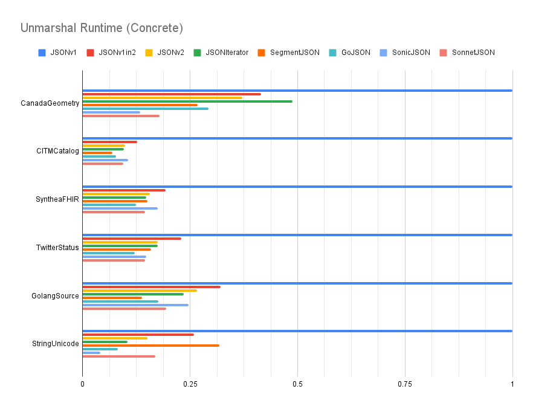
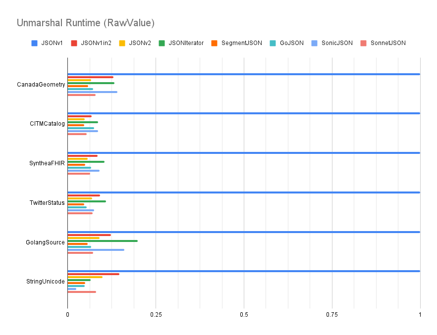

# JSON Benchmarks

Each of the charts below show the performance across
several different JSON implementations:

* `JSONv1` is `encoding/json` at `v1.21.1`
* `JSONv2` is `github.com/go-json-experiment/json` at `v0.0.0-20230906215633-699550ab4a68`
* `JSONIterator` is `github.com/json-iterator/go` at `v1.1.12`
* `SegmentJSON` is `github.com/segmentio/encoding/json` at `v0.3.6`
* `GoJSON` is `github.com/goccy/go-json` at `v0.10.2`
* `SonicJSON` is `github.com/bytedance/sonic` at `v1.10.1`

The Go toolchain used is `v1.21.1`.

Based on the module proxy as of 2023-07-01, the relative popularity of each:
* `JSONv1` has 1.3M imports
* `JSONv2` has 47 imports
* `JSONIterator` has 17k imports
* `SegmentJSON` has 347 imports
* `GoJSON` has 2k imports
* `SonicJSON` has 517 imports

Note that `JSONv2` deliberately dissuades users from depending on the package
as it is an experiment and is subject to major breaking changes.

Benchmarks were run across various datasets:

* `CanadaGeometry` is a GeoJSON (RFC 7946) representation of Canada.
  It contains many JSON arrays of arrays of two-element arrays of numbers.
* `CITMCatalog` contains many JSON objects using numeric names.
* `SyntheaFHIR` is sample JSON data from the healthcare industry.
  It contains many nested JSON objects with mostly string values,
  where the set of unique string values is relatively small.
* `TwitterStatus` is the JSON response from the Twitter API.
  It contains a mix of all different JSON kinds, where string values
  are a mix of both single-byte ASCII and multi-byte Unicode.
* `GolangSource` is a simple tree representing the Go source code.
  It contains many nested JSON objects, each with the same schema.
* `StringUnicode` contains many strings with multi-byte Unicode runes.

All of the implementations other than `JSONv1` and `JSONv2` make
extensive use of `unsafe`. As such, we expect those to generally be faster,
but at the cost of memory and type safety. `SonicJSON` goes a step even further
and uses just-in-time compilation to generate machine code specialized
for the Go type being marshaled or unmarshaled.
Also, `SonicJSON` does not validate JSON strings for valid UTF-8,
and so gains a notable performance boost on datasets with multi-byte Unicode.
Benchmarks are performed based on the default marshal and unmarshal behavior
of each package. Note that `JSONv2` aims to be safe and correct by default,
which may not be the most performant strategy.

`JSONv2` has several semantic changes relative to `JSONv1` that
impacts performance:

1.  When marshaling, `JSONv2` no longer sorts the keys of a Go map.
    This will improve performance.

2.  When marshaling or unmarshaling, `JSONv2` always checks
    to make sure JSON object names are unique.
    This will hurt performance, but is more correct.

3.  When marshaling or unmarshaling, `JSONv2` always
    shallow copies the underlying value for a Go interface and
    shallow copies the key and value for entries in a Go map.
    This is done to keep the value as addressable so that `JSONv2` can
    call methods and functions that operate on a pointer receiver.
    This will hurt performance, but is more correct.

All of the charts are unit-less since the values are normalized
relative to `JSONv1`, which is why `JSONv1` always has a value of 1.
A lower value is better (i.e., runs faster).

Benchmarks were performed on an AMD Ryzen 9 5900X.

## Marshal Performance

### Concrete types


* This compares marshal performance when serializing
  [from concrete types](/testdata_test.go).
* The `JSONv1` implementation is close to optimal (without the use of `unsafe`).
* Relative to `JSONv1`, `JSONv2` is around performance parity.
* Relative to `JSONIterator`, `JSONv2` is up to 1.4x faster.
* Relative to `SegmentJSON`, `JSONv2` is up to 1.9x slower.
* Relative to `GoJSON`, `JSONv2` is up to 1.5x slower.
* Relative to `SonicJSON`, `JSONv2` is about 2.2x to 3.9x slower
  (ignoring `StringUnicode` since `SonicJSON` does not validate UTF-8).
* For `JSONv1` and `JSONv2`, marshaling from concrete types is
  mostly limited by the performance of Go reflection.

### Interface types


* This compares marshal performance when serializing from
  `any`, `map[string]any`, and `[]any` types.
* Relative to `JSONv1`, `JSONv2` is about 1.4x to 3.8x faster.
* Relative to `JSONIterator`, `JSONv2` is about 1.1x to 2.6x faster.
* Relative to `SegmentJSON`, `JSONv2` is about 1.1x to 1.9x faster.
* Relative to `GoJSON`, `JSONv2` is about 1.4x to 3.0x faster.
* Relative to `SonicJSON`, `JSONv2` is around performance parity
  (ignoring `StringUnicode` since `SonicJSON` does not validate UTF-8).
* `JSONv2` is generally as fast or faster than the alternatives.
  One advantange is because it does not sort the keys for a `map[string]any`,
  while alternatives (except `SonicJSON` and `JSONIterator`) do sort the keys.

### RawValue types


* This compares performance when marshaling from a `jsontext.Value`.
  This mostly exercises the underlying encoder and
  hides the cost of Go reflection.
* Relative to `JSONv1`, `JSONv2` is about 3.6x to 9.1x faster.
* `JSONIterator` is blazingly fast because
  [it does not validate whether the raw value is valid](https://go.dev/play/p/bun9IXQCKRe)
  and simply copies it to the output.
* Relative to `SegmentJSON`, `JSONv2` is about 1.4x to 2.7x faster.
* Relative to `GoJSON`, `JSONv2` is 1.1x slower or up to 2.2x faster.
* Relative to `SonicJSON`, `JSONv2` is 1.3x slower or up to 1.5x faster.
* Aside from `JSONIterator`, `JSONv2` is generally as fast or fastest.

## Unmarshal Performance

### Concrete types



* This compares unmarshal performance when deserializing
  [into concrete types](/testdata_test.go).
* Relative to `JSONv1`, `JSONv2` is about 2.5x to 8.4x faster.
* Relative to `JSONIterator`, `JSONv2` is about 0.8x to 1.5x slower.
* Relative to `SegmentJSON`, `JSONv2` is up to 2.1x slower.
* Relative to `GoJSON`, `JSONv2` is about 1.3x to 1.7x slower.
* Relative to `SonicJSON`, `JSONv2` is up to 2.9x slower
  (ignoring `StringUnicode` since `SonicJSON` does not validate UTF-8).
* For `JSONv1` and `JSONv2`, unmarshaling into concrete types is
  mostly limited by the performance of Go reflection.

### Interface types


* This compares unmarshal performance when deserializing into
  `any`, `map[string]any`, and `[]any` types.
* Relative to `JSONv1`, `JSONv2` is about 1.8x to 5.0x faster.
* Relative to `JSONIterator`, `JSONv2` is up to 1.9x faster.
* Relative to `SegmentJSON`, `JSONv2` is about 1.5 to 3.4x faster.
* Relative to `GoJSON`, `JSONv2` is up to 1.4x faster.
* Relative to `SonicJSON`, `JSONv2` is up to 1.3x slower
  (ignoring `StringUnicode` since `SonicJSON` does not validate UTF-8).
* Aside from `SonicJSON`, `JSONv2` is generally just as fast
  or faster than all the alternatives.

### RawValue types



* This compares performance when unmarshaling into a `jsontext.Value`.
  This mostly exercises the underlying decoder and
  hides away most of the cost of Go reflection.
* Relative to `JSONv1`, `JSONv2` is about 9.3x to 17.2x faster.
* Relative to `JSONIterator`, `JSONv2` is up to 2.2x faster.
* Relative to `SegmentJSON`, `JSONv2` is 1.7x slower or up to 1.9x faster.
* Relative to `GoJSON`, `JSONv2` is 1.9x slower or up to 1.8x faster.
* Relative to `SonicJSON`, `JSONv2` is up to 1.9x faster
  (ignoring `StringUnicode` since `SonicJSON` does not validate UTF-8).
* `JSONv1` takes a
  [lexical scanning approach](https://talks.golang.org/2011/lex.slide#1),
  which performs a virtual function call for every byte of input.
  In contrast, `JSONv2` makes heavy use of iterative and linear parsing logic
  (with extra complexity to resume parsing when encountering segmented buffers).
* `JSONv2` is comparable to the alternatives that use `unsafe`.
  Generally it is faster, but sometimes it is slower.

# Streaming

When reading from an `io.Reader` and writing to an `io.Writer`,
a JSON implementation should not need a buffer much larger than
the largest JSON token encountered within the entire JSON value.
For example, marshaling and unmarshaling a `[{},{},{},{},{},...]`
that is a gigabyte in size should not need to buffer the entire JSON array,
but only enough to buffer each individual `{` or `}`.
An implementation with true streaming support will use
a fixed amount of memory regardless of the total size of the JSON value.

The following implementations have true streaming support:

| Implementation | Marshal | Unmarshal |
| -------------- | ------- | --------- |
| JSONv1         | ❌      | ❌        |
| JSONv2         | ✔️      | ✔️        |
| JSONIterator   | ❌      | ✔️        |
| SegmentJSON    | ❌      | ❌        |
| GoJSON         | ❌      | ❌        |
| SonicJSON      | ❌      | ❌        |

* `JSONv2` was designed from the beginning to have true streaming support.
* `JSONIterator` (perhaps in honor of the "iterator" in its name)
  prioritize true streaming, but only for unmarshaling.

See [`TestStreaming`](/bench_test.go#:~:text=TestStreaming) for more information.

# Correctness

A package may be fast, but it must still be correct and realiable.

* `GoJSON` non-deterministically fails on some tests in this module:
  ```
  --- FAIL: TestRoundtrip/TwitterStatus/Interface/GoJSON/MarshalWrite (0.04s)
  Marshal error: encoder: opcode  has not been implemented
  ```
  ```
  --- FAIL: TestRoundtrip/GolangSource/Interface/GoJSON/MarshalWrite (0.16s)
  Marshal error: opcode SliceEnd has not been implemented
  ```
  ```
  --- FAIL: TestRoundtrip/GolangSource/Interface/GoJSON/Marshal
  Marshal error: invalid character ',' after object key
  ```
  ```
  --- FAIL: TestRoundtrip/GolangSource/Interface/GoJSON/Marshal (0.16s)
  panic: runtime error: slice bounds out of range [19812224:1940444]

  goroutine 390 [running]:
  testing.tRunner.func1.2({0x132a580, 0xc002b56018})
    go1.21.1/src/testing/testing.go:1545 +0x238
  testing.tRunner.func1()
    go1.21.1/src/testing/testing.go:1548 +0x397
  panic({0x132a580?, 0xc002b56018?})
    go1.21.1/src/runtime/panic.go:914 +0x21f
  github.com/goccy/go-json/internal/encoder/vm.Run(0xc0035984e0, {0xc0035cc000?, 0x0?, 0x400?}, 0xc0034c4000?)
    github.com/goccy/go-json@v0.10.2/internal/encoder/vm/vm.go:440 +0x26505
  github.com/goccy/go-json.encodeRunCode(0x40?, {0xc0035cc000?, 0xc0035a8080?, 0x0?}, 0xc00012fd38?)
    github.com/goccy/go-json@v0.10.2/encode.go:310 +0x56
  github.com/goccy/go-json.encode(0xc0035984e0, {0x12c4760, 0xc00235ef20})
    github.com/goccy/go-json@v0.10.2/encode.go:235 +0x205
  github.com/goccy/go-json.(*Encoder).encodeWithOption(0xc0035d5e60, 0xc0035984e0, {0x12c4760, 0xc00235ef20}, {0x0, 0x0, 0x49084f?})
    github.com/goccy/go-json@v0.10.2/encode.go:77 +0x129
  github.com/goccy/go-json.(*Encoder).EncodeWithOption(0x1310600?, {0x12c4760, 0xc00235ef20}, {0x0, 0x0, 0x0})
    github.com/goccy/go-json@v0.10.2/encode.go:42 +0x8d
  github.com/goccy/go-json.(*Encoder).Encode(...)
    github.com/goccy/go-json@v0.10.2/encode.go:34
  jsonbench.glob..func17({0x15b1b20?, 0xc0035b23c0?}, {0x12c4760?, 0xc00235ef20?})
    github.com/go-json-experiment/jsonbench/bench_test.go:112 +0x69
  jsonbench.TestRoundtrip.func3(0xc002e44000)
    github.com/go-json-experiment/jsonbench/bench_test.go:159 +0x11f
  testing.tRunner(0xc002e44000, 0xc0008b9000)
    go1.21.1/src/testing/testing.go:1595 +0xff
  created by testing.(*T).Run in goroutine 44
    go1.21.1/src/testing/testing.go:1648 +0x3ad
  exit status 2
  ```
  ```
  --- FAIL: TestRoundtrip/StringUnicode/RawValue/GoJSON/Unmarshal (0.01s)
	panic: runtime error: invalid memory address or nil pointer dereference
  [signal SIGSEGV: segmentation violation code=0x1 addr=0x0 pc=0x1129b47]

  goroutine 483 [running]:
  testing.tRunner.func1.2({0x12e91c0, 0x1c6ce80})
    go1.21.1/src/testing/testing.go:1545 +0x238
  testing.tRunner.func1()
    go1.21.1/src/testing/testing.go:1548 +0x397
  panic({0x12e91c0?, 0x1c6ce80?})
    go1.21.1/src/runtime/panic.go:914 +0x21f
  github.com/goccy/go-json/internal/decoder.(*unmarshalJSONDecoder).DecodeStream(0x0, 0xc00388a000, 0xc00388c000?, 0xc003882030)
    github.com/goccy/go-json@v0.10.2/internal/decoder/unmarshal_json.go:48 +0xe7
  github.com/goccy/go-json.(*Decoder).DecodeWithOption(0xc00342cea8, {0x132b7a0, 0xc003882030}, {0x0, 0x0, 0xc00342ceb0?})
    github.com/goccy/go-json@v0.10.2/decode.go:233 +0xe6
  github.com/goccy/go-json.(*Decoder).Decode(...)
    github.com/goccy/go-json@v0.10.2/decode.go:199
  jsonbench.glob..func18({0x15b1b40?, 0xc003886060}, {0x132b7a0, 0xc003882030})
    github.com/go-json-experiment/jsonbench/bench_test.go:113 +0x12b
  jsonbench.TestRoundtrip.func4(0xc003431ba0)
    github.com/go-json-experiment/jsonbench/bench_test.go:188 +0x1d3
  testing.tRunner(0xc003431ba0, 0xc003426580)
    go1.21.1/src/testing/testing.go:1595 +0xff
  created by testing.(*T).Run in goroutine 26
    go1.21.1/src/testing/testing.go:1648 +0x3ad
  exit status 2
  ```
  ```
  unexpected fault address 0x0
  fatal error: fault
  [signal SIGSEGV: segmentation violation code=0x80 addr=0x0 pc=0x119d888]

  goroutine 83 [running]:
  runtime.throw({0x1368c41?, 0xc000028930?})
      go1.21.1/src/runtime/panic.go:1077 +0x5c fp=0xc001a79900 sp=0xc001a798d0 pc=0x43aedc
  runtime.sigpanic()
      go1.21.1/src/runtime/signal_unix.go:875 +0x285 fp=0xc001a79960 sp=0xc001a79900 pc=0x451ee5
  github.com/goccy/go-json/internal/encoder/vm.Run(0xc0019d2680, {0xc00002ec00?, 0xae0?, 0x12c92c0?}, 0x1?)
      github.com/goccy/go-json@v0.10.2/internal/encoder/vm/vm.go:560 +0x15f88 fp=0xc001a7bcb8 sp=0xc001a79960 pc=0x119d888
  github.com/goccy/go-json.encodeRunCode(0x40?, {0xc00002ec00?, 0xc0014e3580?, 0x0?}, 0xc000279d38?)
      github.com/goccy/go-json@v0.10.2/encode.go:310 +0x56 fp=0xc001a7bcf0 sp=0xc001a7bcb8 pc=0x11af136
  github.com/goccy/go-json.encode(0xc0019d2680, {0x12bc060, 0xc000297280})
      github.com/goccy/go-json@v0.10.2/encode.go:235 +0x205 fp=0xc001a7bd70 sp=0xc001a7bcf0 pc=0x11aecc5
  github.com/goccy/go-json.(*Encoder).encodeWithOption(0xc001a7be60, 0xc0019d2680, {0x12bc060, 0xc000297280}, {0x0, 0x0, 0x49084f?})
      github.com/goccy/go-json@v0.10.2/encode.go:77 +0x129 fp=0xc001a7bdc8 sp=0xc001a7bd70 pc=0x11ae809
  github.com/goccy/go-json.(*Encoder).EncodeWithOption(0x1310600?, {0x12bc060, 0xc000297280}, {0x0, 0x0, 0x0})
      github.com/goccy/go-json@v0.10.2/encode.go:42 +0x8d fp=0xc001a7be30 sp=0xc001a7bdc8 pc=0x11ae64d
  github.com/goccy/go-json.(*Encoder).Encode(...)
      github.com/goccy/go-json@v0.10.2/encode.go:34
  jsonbench.glob..func17({0x15b1b20?, 0xc001a67320?}, {0x12bc060?, 0xc000297280?})
      github.com/go-json-experiment/jsonbench/bench_test.go:112 +0x69 fp=0xc001a7bea8 sp=0xc001a7be30 pc=0x128ff69
  jsonbench.TestRoundtrip.func3(0xc001a81860)
      github.com/go-json-experiment/jsonbench/bench_test.go:159 +0x11f fp=0xc001a7bf70 sp=0xc001a7bea8 pc=0x12910bf
  testing.tRunner(0xc001a81860, 0xc0004f5800)
      go1.21.1/src/testing/testing.go:1595 +0xff fp=0xc001a7bfc0 sp=0xc001a7bf70 pc=0x516fff
  testing.(*T).Run.func1()
      go1.21.1/src/testing/testing.go:1648 +0x25 fp=0xc001a7bfe0 sp=0xc001a7bfc0 pc=0x517f85
  runtime.goexit()
      go1.21.1/src/runtime/asm_amd64.s:1650 +0x1 fp=0xc001a7bfe8 sp=0xc001a7bfe0 pc=0x470761
  created by testing.(*T).Run in goroutine 39
      go1.21.1/src/testing/testing.go:1648 +0x3ad
  ```
  ```
  runtime: marked free object in span 0x7fe644a065b0, elemsize=896 freeindex=0 (bad use of unsafe.Pointer? try -d=checkptr)
  0xc000142000 alloc marked  
  0xc000142380 alloc unmarked
  0xc000142700 alloc marked  
  0xc000142a80 free  unmarked
  0xc000142e00 free  unmarked
  0xc000143180 free  unmarked
  0xc000143500 alloc marked  
  0xc000143880 free  marked   zombie
  0x000000c000143880:  0x0000000000000017  0x000000c0001438f8 
  0x000000c000143890:  0x000000c000143ad8  0x0000000000000000 
  0x000000c0001438a0:  0x0000000000000000  0x0000000000000000 
  0x000000c0001438b0:  0x0000000000000000  0x00000000012e4f80 
  0x000000c0001438c0:  0x0000000000000000  0x0000000000000000 
  0x000000c0001438d0:  0x0000000000000000  0x0000000000000000 
  0x000000c0001438e0:  0x0000000000000000  0x0000000000000000 
  0x000000c0001438f0:  0x0000000000000000  0x0000001000000013 
  0x000000c000143900:  0x000000c000143970  0x0000000000000000 
  0x000000c000143910:  0x0000000000000000  0x0000000000000000 
  0x000000c000143920:  0x0000000000000000  0x0000000000000000 
  0x000000c000143930:  0x00000000012c9000  0x0000000000000000 
  0x000000c000143940:  0x0000000000000000  0x0000000000000000 
  0x000000c000143950:  0x0000000000000000  0x0000000000000001 
  0x000000c000143960:  0x0000000000000000  0x0000000000000000 
  0x000000c000143970:  0x0000000000000008  0x000000c0001439e8 
  0x000000c000143980:  0x000000c000143ad8  0x0000000000000000 
  0x000000c000143990:  0x0000000000000000  0x0000000000000000 
  0x000000c0001439a0:  0x0000000000000000  0x00000000012dc620 
  0x000000c0001439b0:  0x0000000000000000  0x0000000000000000 
  0x000000c0001439c0:  0x0000000000000000  0x0000000000000000 
  0x000000c0001439d0:  0x0000000000000002  0x0000000000000000 
  0x000000c0001439e0:  0x0000000000000000  0x0000002000000001 
  0x000000c0001439f0:  0x000000c000143a60  0x0000000000000000 
  0x000000c000143a00:  0x0000000000000000  0x0000000000000000 
  0x000000c000143a10:  0x0000000000000000  0x0004000000000000 
  0x000000c000143a20:  0x00000000012dc620  0x0000000000000000 
  0x000000c000143a30:  0x0000000000000000  0x0000000800000000 
  0x000000c000143a40:  0x0000000000000001  0x0000000000000003 
  0x000000c000143a50:  0x0000000000000000  0x0000000000000000 
  0x000000c000143a60:  0x0000000000000007  0x000000c0001438f8 
  0x000000c000143a70:  0x000000c000143ad8  0x0000000000000000 
  0x000000c000143a80:  0x0000000000000000  0x0000000000000000 
  0x000000c000143a90:  0x0000000000000000  0x00000000012c9000 
  0x000000c000143aa0:  0x0000000000000000  0x0000000000000000 
  0x000000c000143ab0:  0x0000000000000000  0x0000000000000000 
  0x000000c000143ac0:  0x0000000000000004  0x0000000000000000 
  0x000000c000143ad0:  0x0000000000000000  0x0000000000000009 
  0x000000c000143ae0:  0x000000c000143b50  0x0000000000000000 
  0x000000c000143af0:  0x0000000000000000  0x0000000000000000 
  0x000000c000143b00:  0x0000000000000000  0x0000000000000000 
  0x000000c000143b10:  0x00000000012e4f80  0x0000000000000000 
  0x000000c000143b20:  0x0000000000000000  0x0000000000000000 
  0x000000c000143b30:  0x0000000000000000  0x0000000000000005 
  0x000000c000143b40:  0x0000000000000000  0x0000000000000000 
  0x000000c000143b50:  0x000000400000000d  0x0000000000000000 
  0x000000c000143b60:  0x0000000000000000  0x0000000000000000 
  0x000000c000143b70:  0x0000000000000000  0x0000000000000000 
  0x000000c000143b80:  0x0000000000000000  0x00000000012e4f80 
  0x000000c000143b90:  0x0000000000000000  0x0000000000000000 
  0x000000c000143ba0:  0x0000005000000048  0x0000000000000000 
  0x000000c000143bb0:  0x0000000000000006  0x0000000000000000 
  0x000000c000143bc0:  0x0000000000000000  0x0000000000000000 
  0x000000c000143bd0:  0x0000000000000000  0x0000000000000000 
  0x000000c000143be0:  0x0000000000000000  0x0000000000000000 
  0x000000c000143bf0:  0x0000000000000000  0x0000000000000000 
  0xc000143c00 free  unmarked
  fatal error: found pointer to free object
  ```

## UTF-8 Validation

According to [RFC 8259, section 8.1](https://datatracker.ietf.org/doc/html/rfc8259#section-8.1),
a JSON value must be encoded using UTF-8.

The following table shows how each implementation handles invalid UTF-8:

| Implementation | Marshal      | Unmarshal   |
| -------------- | ------------ | ----------- |
| JSONv1         | ⚠️ replaced  | ⚠️ replaced |
| JSONv2         | ✔️ rejected  | ✔️ rejected |
| JSONIterator   | ⚠️ replaced  | ❌ ignored  |
| SegmentJSON    | ⚠️ replaced  | ⚠️ replaced |
| GoJSON         | ⚠️ replaced  | ❌ ignored  |
| SonicJSON      | ❌ ignored   | ❌ ignored  |

Notes:
* "Rejected" means that the presence of invalid UTF-8 results in an error.
  This is the most correct behavior.
* "Replaced" means that invalid UTF-8 bytes is replaced with `utf8.RuneError`.
  This can be arguably correct behavior for marshaling since it produces
  valid UTF-8 in the output, but silently corrupts strings with invalid UTF-8.
  This is incorrect behavior for unmarshaling since it treats
  non-complaint JSON as valid.
* "Ignored" means that invalid UTF-8 is not checked for at all and
  is passed through during serialization. This is incorrect behavior.
* Only `JSONv2` rejects invalid UTF-8 for both marshaling and unmarshaling.
  It provides an `AllowInvalidUTF8` option to opt into the "replaced" behavior.
* `JSONv1` and `SegmentJSON` both follow the "replaced" behavior.
* `JSONIterator` and `Segment` use the "replaced" behavior for marshaling
  and the incorrect "ignored" behavior for unmarshaling.
* `SonicJSON` alone uses the incorrect "ignored" behavior
  for both marshaling and unmarshaling.

See [`TestValidateUTF8`](/bench_test.go#:~:text=TestValidateUTF8) for more information.

## Duplicate Object Names

[RFC 8259, section 4](https://datatracker.ietf.org/doc/html/rfc8259#section-4)
specifies that handling of a JSON object with duplicate names results in
undefined behavior where compliant parsers may use the first member,
the last member, all the members, or report an error.
[RFC 7493, section 2.3](https://datatracker.ietf.org/doc/html/rfc7493#section-2.3)
specifies that JSON objects must not have duplicate names.
Rejecting duplicate object names is more correct,
but incurs a performance cost verifying this property.

The following table shows how each implementation handles duplicate object names:

| Implementation | Marshal      | Unmarshal   |
| -------------- | ------------ | ----------- |
| JSONv1         | ❌ allowed   | ❌ allowed  |
| JSONv2         | ✔️ rejected  | ✔️ rejected |
| JSONIterator   | ❌ allowed   | ❌ allowed  |
| SegmentJSON    | ❌ allowed   | ❌ allowed  |
| GoJSON         | ❌ allowed   | ❌ allowed  |
| SonicJSON      | ❌ allowed   | ❌ allowed  |

See [`TestDuplicateNames`](/bench_test.go#:~:text=TestDuplicateNames) for more information.

## Parsing Test Suite

["Parsing JSON is a Minefield 💣"](https://seriot.ch/projects/parsing_json.html)
(posted 2016-10-26) performed one of the first thorough comparisons of
JSON parsers and their behavior on various edge-cases.
At the time, [RFC 7159](https://www.rfc-editor.org/rfc/rfc7159.html)
was the authoritative standard, but has since been superseded by
[RFC 8259](https://www.rfc-editor.org/rfc/rfc8259.html).
Consequently, the expected results of some of the test cases from the article
were changed to be more compliant with RFC 8259.

The following table shows the number of test case failures
for each implementation when tested against RFC 8259:

| Implementation | String | Number  | Object | Array   | Other  |
| -------------- | ------ | ------- | ------ | ------- | ------ |
| JSONv1         | ❌ 10x | ✔️     | ✔️     | ✔️     | ✔️     |
| JSONv2         | ✔️     | ✔️     | ✔️     | ✔️     | ✔️     |
| JSONIterator   | ❌ 10x | ❌ 4x  | ✔️     | ✔️     | ✔️     |
| SegmentJSON    | ❌ 10x | ✔️     | ✔️     | ✔️     | ✔️     |
| GoJSON         | ❌ 30x | ❌ 52x | ❌ 20x | ❌ 17x | ❌ 10x |
| SonicJSON      | ❌ 28x | ✔️     | ✔️     | ❌ 1x  | ✔️     |

* `JSONv1`, `JSONIterator`, and `SegmentJSON` all fail on the same set of
  JSON string tests that are related to UTF-8 validation.
  Presumably, `JSONIterator` and `SegmentJSON` copied `JSONv1`'s behavior
  because they aim to be drop-in replacements for `JSONv1`.
* `GoJSON` and `SonicJSON` fails many more JSON string tests both in areas that
  relate to UTF-8 validation, but also in cases where the input is clearly
  not a valid JSON string (as agreed upon by the other implementations).
* `JSONIterator` fails some JSON number tests. Some of these relate to values
  that are vastly beyond the representation of numeric Go types.
  These failures are technically permitted by [RFC 8259, section 9](https://datatracker.ietf.org/doc/html/rfc8259#section-9) when transforming JSON into another data representation.
  However, our tests were parsing the input into a `jsontext.Value`,
  where the limits of numeric precision should not play a relevant role.
  In other cases, `JSONIterator` permitted parsing of JSON numbers that
  are not valid (as agreed upon by the other implementations).
* `GoJSON` fails many other test cases in all categories.

[RFC 7493](https://www.rfc-editor.org/rfc/rfc7493.html)
is compatible with RFC 8259 in that it makes strict decisions
about behavior that RFC 8259 leaves undefined.
In particular, it rejects escaped surrogate pairs that are invalid and
rejects JSON object with duplicate names.

The following table shows **additional** test case failures
for each implementation when tested against RFC 7493:

| Implementation | String | Number | Object | Array | Other |
| -------------- | ------ | ------ | ------ | ----- | ----- |
| JSONv1         | ❌ 9x  | ✔️    | ❌ 3x  | ✔️   | ✔️    |
| JSONv2         | ✔️     | ✔️    | ✔️     | ✔️   | ✔️    |
| JSONIterator   | ❌ 9x  | ✔️    | ❌ 3x  | ✔️   | ✔️    |
| SegmentJSON    | ❌ 9x  | ✔️    | ❌ 3x  | ✔️   | ✔️    |
| GoJSON         | ❌ 9x  | ✔️    | ❌ 3x  | ✔️   | ✔️    |
| SonicJSON      | ❌ 9x  | ✔️    | ❌ 3x  | ✔️   | ✔️    |

* `JSONv2` passes all cases since it targets compliance with RFC 7493.

See [`TestParseSuite`](/bench_test.go#:~:text=TestParseSuite) for more information.

## MarshalJSON Validation

A JSON implementation should not trust that the output of a `MarshalJSON` method
is valid JSON nor formatted in the same way as surrounding JSON.
Consequently, it should parse and reformat the JSON output to be consistent.

The following table shows which implementations validate `MarshalJSON` output:

| Implementation | Validates |
| -------------- | --------- |
| JSONv1         | ✔️ yes    |
| JSONv2         | ✔️ yes    |
| JSONIterator   | ❌ no     |
| SegmentJSON    | ✔️ yes    |
| GoJSON         | ✔️ yes    |
| SonicJSON      | ✔️ yes    |

* `JSONIterator` naively mem-copies the result of `MarshalJSON` to
  the JSON output, resulting in drastic performance gains over
  alternative implementations.

See [`TestValidateMarshalJSON`](/bench_test.go#:~:text=TestValidateMarshalJSON) for more information.

## Deterministic Map Ordering

[RFC 8259](https://datatracker.ietf.org/doc/html/rfc8259)
specifies that JSON objects are an "unordered collection".
Thus, a compliant JSON marshaler need not serialize Go maps entries
in any particular order.

The `JSONv1` implementation historically sorted keys, which consequently
set the precedence for other JSON implementations to do likewise.
The `JSONv2` implementation no longer sorts keys for better performance
and because it does not violate any specified facet of correctness.

The following table shows which implementations deterministically marshal maps:

| Implementation | Deterministic |
| -------------- | ------------- |
| JSONv1         | ✔️ yes        |
| JSONv2         | ❌ no         |
| JSONIterator   | ❌ no         |
| SegmentJSON    | ✔️ yes        |
| GoJSON         | ✔️ yes        |
| SonicJSON      | ❌ no         |

See [`TestMapDeterminism`](/bench_test.go#:~:text=TestMapDeterminism) for more information.

## Observable Changes With Unmarshal Errors

Implementations differ regarding how much of the output value is modified
when an unmarshaling error is encountered.

There are generally two reasonable behaviors:
1. Make no mutating changes to the output if the input is invalid.
2. Make as many changes as possible up until the input becomes invalid.

The following table shows what changes are observable if the input is invalid:

| Implementation | Observable Changes |
| -------------- | ------------------ |
| JSONv1         | ✔️ none           |
| JSONv2         | ⚠️ all            |
| JSONIterator   | ⚠️ all            |
| SegmentJSON    | ❌ some           |
| GoJSON         | ❌ some           |
| SonicJSON      | ⚠️ all            |

* The `JSONv1` implementation alone takes the first approach.
  This fundamentally requires a two-pass parsing, where the first pass
  validates the JSON input, and the second pass does the actual unmarshal work.
  All other implementations abandon this semantic since it is non-performant.
* `JSONv2`, `JSONIterator`, and `Sonic` take the second approach of unmarshaling
  into the output as much as possible up until an error is encountered.
* `SegmentJSON` and `GoJSON` hold to an odd position between the two extremes.

See [`TestUnmarshalErrors`](/bench_test.go#:~:text=TestUnmarshalErrors) for more information.

# Binary Size

For use in embedded or mobile applications, a small binary size is a priority.
The following table shows the binary sizes of each JSON implementation for
a simple Go program that just links in `json.Marshal` and `json.Unmarshal`.
These were built with `GOOS=linux` and `GOARCH=amd64`.

| Implementation | Size     |
| -------------- | -------- |
| JSONv1         | 2.18 MiB |
| JSONv2         | 2.89 MiB |
| JSONIterator   | 3.11 MiB |
| SegmentJSON    | 2.52 MiB |
| GoJSON         | 3.39 MiB |
| SonicJSON      | 24.7 MiB |

* `JSONv1` and `JSONv2` are among the smallest because they only use Go reflection.
  Using an abstraction layer is slower, but avoids duplicated unsafe logic.
* `JSONv2` is larger than `SegmentJSON` as it implements many additional features.
* `SonicJSON` is the largest since it includes a just-in-time compiler.

See [`TestBinarySize`](/bench_test.go#:~:text=TestBinarySize) for more information.
